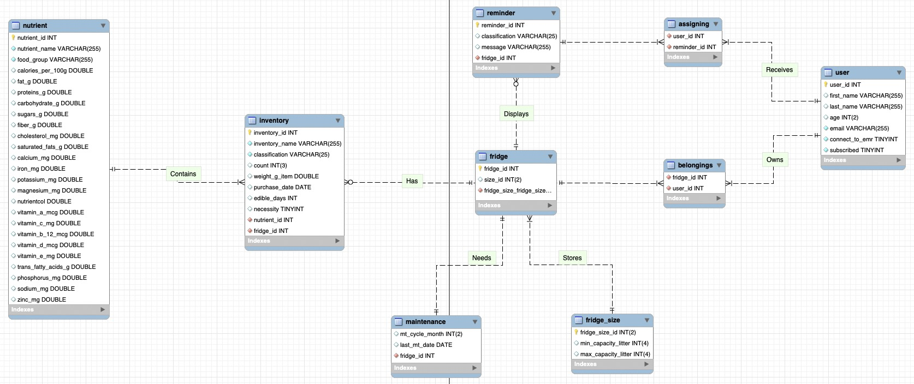

# IFridge
This is a database design project using MySQL and docker.

## Introduction
Due to the fact that American now get approximately 60 percent of their energy from processed
food and ‘fresh’ has been articulated to be a highly-sought attribute for refrigerated products
as well as common food in general. [11] Our app also provides recommendations of the healthy
diet for user. It could also be authorized to connect to one’s EMR for more professional and
personal recommendations about diet and health.
This application will contribute to problem-solving beyond unconscious food waste. As products
like iFridge are put into practical use at a larger scale, we expect more connections and
collaborations between digital records like Health app, inventory lists from nearby grocery
stores, EMR, health insurance, etc. The growing database could tell us about food qualities,
habits, lifestyles, family relationships, geographical distribution of features in urban areas,
market share, differences at an international scale and aspects that contribute to academic
research and help decision-makers with potential changes before trends evolve to bigger
problems.

## Design
There are nine tables in our database design. 
Here is the conceptual model of the database which was developed based on the research about users’ habits and requirements towards the
functionalities of the fridges.

